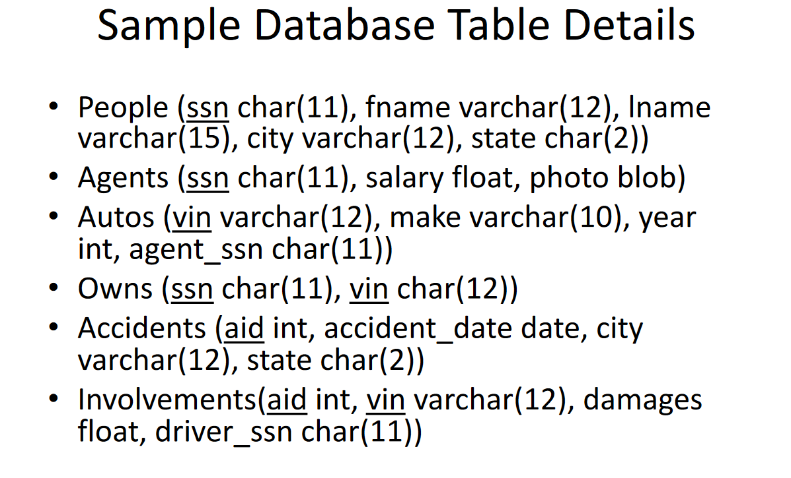

# Database Management User Interface: _command line user interface for a sample automobile insurance database using SQLite_
---
## To run the program:
Download all files in this repository and save in one folder. 
Then navigate to that folder in the command line.
Then execute this line of code: java -jar DatabaseProject.jar
The program will load.

## Functions
Users can add a new accident to the database, search the database for accident records using multiple searching options.

### Database schema:

   

